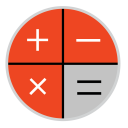
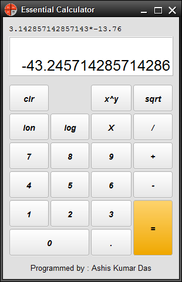

<h1>Essential Calculator</h1>
<h3><i>
Simple desktop calculator program
 
Version 2 is coming with lot more useful calculator operations...
</i></h3>

This is a very simple and handy calculator program.
 It is written in Java and uses custom theme to make it looking attaractive.
Its type is a Graphical Calculator, not a Stack-based Formula calculator. 

<h3>Operations Implemented</h3>

<ul>
  <li><b>Simple Operations</b></li>
    <ul>
      <li>Addition</li>
      <li>Substraction</li>
      <li>Multiplication</li>
      <li>Division</li>
    </ul>
    
  <li><b>Advanced Operations</b></li>
    <ul>
      <li>Log (base 10)</li>
      <li>Lon (base e)</li>
      <li>Power</li>
      <li>Square Root (sqrt)</li>
    </ul>
</ul>

<h3>License</h3>
 This software is licensed under <a rel="license" href="http://www.gnu.org/licenses/lgpl-3.0-standalone.html">GNU Lesser General Public License, Version 3</a>.
